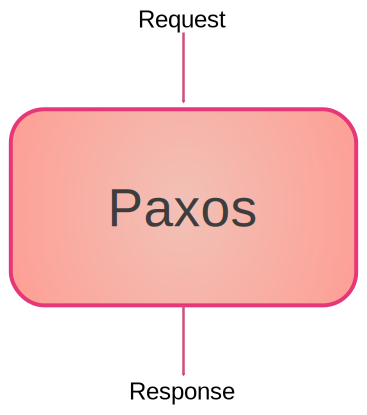

*******
Paxos
*******

Introduction
============
If only one agent uses the database, there is no synchronization problem. On the other hand, if two or more agents use the database, we must guarantee synchronization.
On a :term:`passive server`, there is no synchronization system. Each agent must participate to make this synchronization possible, the agents must reach a "consensus". There is no communication between agents, to reach this consensus, agents must communicate via the :term:`passive server`.

The state-machine approach is a general method for implementing an arbitrary distributed system. The system is designed as a deterministic state machine that executes a sequence of commands, and a consensus algorithm ensures that. This reduces the problem of buildingan arbitrary system to solving the consensus problem. 
We need an algorithme an algorithm to transform any finite-state machine (FSM) into a fault-tolerant distributed system.
=> Time, clocks, and the orderingof events in a distributed system
=> Implementingfault-tolerant services usingthe state
machine approach
state machine replication

**Goal**: This section describes how agents can reach a :term:`consensus`. To do this, we will define a protocol that these agents must follow.
**Constraints**:
- The agents and their means of communication may have breakdowns.
- The solution must ensure that all cases are managed safely.

**problem**: On asynchronous system there is no fault-tolerant algorithm to ensure consensus is reached in a bounded time. This is the **FLP result** discribe in this article :cite:`Fischer1985` `Dijkstra Prize in 2001 <https://en.wikipedia.org/wiki/Dijkstra_Prize>`_.
The FLP result does not state that consensus can never be reached, but progression towards consensus is not guaranteed.

In this situation what do we want?
- A guarantee of safety: no inconsistency possible.
- Blocking situations (which prevent progression towards consensus) must be difficult to create.
=> This is what Paxos protocols propose.

Paxos is not the only solution for solve the consensus, raph, blockchain ... but we thinks in shared-db passive server, paxos is the best approch.

First we describe the simplest form of paxos, which is static paxos. After we describe passive paxos we will be the paxos used in shared-db.

Static Paxos
============
The Goal is to describe Paxos for Dummies, we start from black box to white box description.

Black box: the big picture
-----------

=> Paxos is like an append log. paxos produit an append log of value.
- in effect each value is added to the end of a write-only log that gets longer and longer.
- in fact there is a way to garbage collect from the front of the log, but surprisingly rarely used.

thinking of paxos as a way to make a durable log of messages is the right way to view the protocol 

Open the box: 
---------------

The protocol has two phases:

1 - prepare phase: the system prepare the acceptors to commit some action. several tries may be  required.
2 - decide phase: the system decide what value will be choosed. Sometimes the decision is that no value will be choosed. 

Fig2:
                    BOX P1                           BOX P2

value candidate              
------>          phase 1 prepare ---xxxx>xxx       
                                                                      
value candidate              
------>          phase 1 prepare ---------------> phase 2 decide ------------> value choosed

Core description
---------------

Fig3:

2 phase , each have 2 step

White box: in action
-----------

Fig4
activity diagram

Conclusion
-----------
=> this paxos is the slower form of Paxos , we can speed it up but doing so makes it very complex.

Disk Paxos
=============

define
 - Quorum
 - Synod

the need / context:

overview:
Is it possible to replace all acceptor processes with the Quorum state ?. With Disk Paxos the answer is yes.
(Disk Paxos is a variant of Paxos that replaces acceptor processes with disks that support only read block and write block operations to store the quorum state.)
In Disk Paxos the Quorum state is stored on disk. Each leader owns a block on every disk to which it can write its messages.

protocol:
//To run phase 1 of the Synod protocol, a leader executes the following for each disk.
//   The leader writes a p1a message in its own block on the disk and reads the blocks of other leaders on the same disk to check if there is a p1a message with a higher ballot number.
//   If the leader does not discover a higher ballot number on a majority of disks, its ballot is adopted.
//   If it discovers a p1a message with a higher ballot number,it starts over with a higher ballot number.
//For phase 2, the leader repeats the same process with p2a messages to determine if its proposals are accepted.

conclusion:

Passive Paxos
=============
In passive Paxos we have no Disk, inplace we use a service whose register each message between proposer and acceptor.
This service is a list append only. The only constraint requested from a passive server is to provide this service.
We can find the accepted proposal by examining the logs contained in the list append only 

what is a list append only
-----------

protocol
-----------

how simulate a list append only with storage service API
=============

we want to use common storage service (like dropbox, google drive, baidu, ...) for simulate a list apend only.
All this solution is present in the passive paxos article.

table with solution for each service

.. bibliography:: references.bib